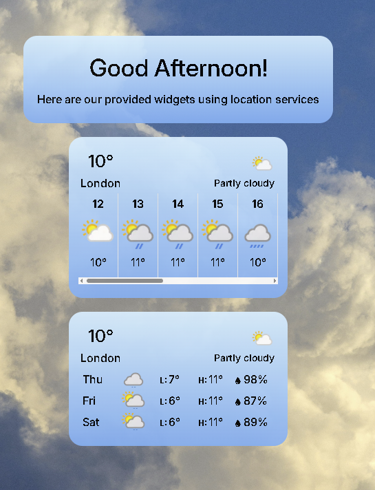
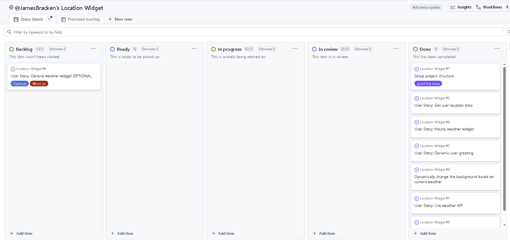

<!-- TOC start (generated with https://github.com/derlin/bitdowntoc) -->

- [Location Widget Application](#location-widget-application)
   * [--> View the deployed verion here <--](#-view-the-deployed-verion-here-)
   * [UX](#ux)
      + [Strategy](#strategy)
      + [Scope](#scope)
      + [Local development](#local-development)
   * [Technologies](#technologies)
   * [Credits](#credits)

<!-- TOC end -->

<!-- TOC -->
# Location Widget Application

<!-- TOC -->
## [--> View the deployed verion here <--](https://jamesbracken.github.io/Location-Widget/)

<!-- TOC -->
## UX

<!-- TOC -->
### Strategy

The aim of the project is to create a responsive accessible widget which uses user location services and the [Weather API](https://www.weatherapi.com/) to provide information about local weather. 

The project provides a hourly and 3 day(Limited because of Weather API free plan) forecast widgets which update in real time using React. Additionally the project sports dynamic background images according to the current weather and adjusts the overlay and text colors according to the time of day.

**General outline**

<!-- TOC -->
### Scope

This project was organized and scope was managed using a Github Kanban Board which can be accessed [here](https://github.com/users/JamesBracken/projects/21/views/2?visibleFields=%5B%22Title%22%2C%22Assignees%22%2C227272141%2C%22Labels%22%2C227272140%2C227272139%5D).

**Agile Methodology**

This project followed an agile methodology approach to be able to reach an MVP prior to adding in extra features. We developed the project iteratively adding features one at a time.

User Stories were used to organize, plan out and think from the perspective of our potential users. With this approach we were able to plot out a roadmap which we could use to develop our entire application.

<!-- TOC -->
### Local development

**Quickstart**

git clone https://github.com/YourName/location-widget.git

cd location-widget

npm install

npm run dev

**Cloning**
Clone this repo with bash

git clone https://github.com/JamesBracken/Location-Widget

**Forking** 
To fork this repository follow [These steps](https://docs.github.com/en/pull-requests/collaborating-with-pull-requests/working-with-forks/fork-a-repo)

<!-- TOC -->
## Technologies

- [VS Code](https://code.visualstudio.com/) ~ Used as my IDE 

- ChatGPT ~ To aid in development

<!-- TOC -->
## Credits

A big thank you to Nology and my coach Remi Hoeppe, they provided the training and support needed to make this project possible.